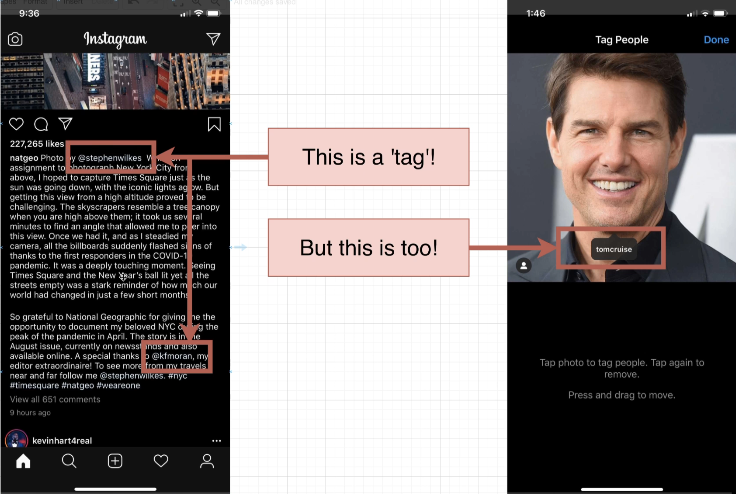

# How to Build a 'Mention' System

<p align="center">
  
</p>

## Additional Features Around Posts

In this section, we will add a few more features around posts to make our application more interactive and engaging. We will implement the following features:

1. **Mentions**: Users can mention other users in their posts by typing `@` followed by the username. When a user is mentioned, they will receive a notification about it.
2. **Tag People**: Users can tag other users in their posts either by typing `@` followed by the username or by selecting the user from a list of suggestions.

- Users can also add a tag to the photo precisely by clicking on the photo and selecting the area to tag.

3. **Location Tagging**: Users can tag a location in their posts. This will allow users to see posts from a specific location and explore new places.

- Posts must have a `longitude` and `latitude` field to store the location information.

4. **Captions**: Users can add captions to their posts to provide more context or information about the post.

- Captions can be up to `n` characters long.

## Adding Captions and Location Tagging

Let's start by adding the `caption` and location tagging features to our posts. We will modify the `posts` table to include these fields:

- `caption`: A VARCHAR(240) field to store the caption for the post.
- `lat`: A real field to store the latitude of the location.
- `lng`: A real field to store the longitude of the location.

```sql
ALTER TABLE posts
ADD COLUMN caption VARCHAR(240),
ADD COLUMN lat REAL,
ADD COLUMN lng REAL;
```

## Photo Mentions vs. Caption Mentions

When a user mentions another user in a post, they can either mention them in the photo itself (by tagging them in the photo) or in the caption of the post. We need to handle these two types of mentions differently:

1. **Photo Mentions**: When a user tags another user in the photo, we need to store the tagged user's ID along with the coordinates of the tag in the photo. This will allow us to display the tagged users when the photo is viewed.

2. **Caption Mentions**: When a user mentions another user in the caption, we need to store the mentioned user's ID in the post. This will allow us to notify the mentioned user about the mention.

- In the case of caption mentions, the mentioned user text doesn't necessarily mean that we need to store something in the database.
- The mobile app could (and probably) should handle highlighting the mentioned user in the caption text.

We would need to store the mentioned user if we want to notify them about the mention, need to show the mention in the user's profile, need to show a list of posts where the user was mentioned, etc.

## Considerations on Photo Tags vs Caption Tags



When a user tags another user in a post, they can either tag them in the photo itself or in the caption of the post. Here are some considerations for handling photo tags vs. caption tags:

1. **Photo Tags**:

   - Photo tags are more visual and interactive as they appear directly on the photo.
   - Users can click on the tagged area to view the tagged user's profile or navigate to their posts.
   - Photo tags can be more engaging and encourage users to explore other users' profiles.

2. **Caption Tags**:
   - Caption tags are more subtle and less intrusive as they appear as text in the post caption.
   - Caption tags can be used to mention users in a more casual or conversational way.
   - Caption tags can be used to provide context or additional information about the post.

Depending on the user experience you want to create, you can choose to implement photo tags, caption tags, or both in your application.

**Tag Solution #1**: We can create a `tags` table to store the tags for each post. The `tags` table would have the following columns:

- `post_id`: The ID of the post being tagged.
- `user_id`: The ID of the user being tagged.
- `x`: The x-coordinate of the tag in the photo.
- `y`: The y-coordinate of the tag in the photo.

A `NULL` value for `x` and `y` would indicate that the user was tagged in the caption.

```sql
CREATE TABLE tags (
  id SERIAL PRIMARY KEY,
  post_id INT,
  user_id INT,
  x REAL,
  y REAL
);
```

The upside to this is that we only need one table to store all the tags, whether they are in the photo or the caption. It is a single resource recording how often a user is tagged.

**Tag Solution #2**: We can create two separate tables: `photo_tags` and `caption_tags` to store photo tags and caption tags separately. The `photo_tags` table would store the tags for each post in the photo, while the `caption_tags` table would store the tags in the caption.

The `photo_tags` table would have the following columns:

- `id`: The ID of the tag.
- `post_id`: The ID of the post being tagged (foreign key).
- `user_id`: The ID of the user being tagged (foreign key).
- `x`: The x-coordinate of the tag in the photo.
- `y`: The y-coordinate of the tag in the photo.

The `caption_tags` table would have the following columns:

- `id`: The ID of the tag.
- `post_id`: The ID of the post being tagged (foreign key).
- `user_id`: The ID of the user being tagged (foreign key).

```sql
CREATE TABLE photo_tags (
  id SERIAL PRIMARY KEY,
  post_id INT REFERENCES posts(id),
  user_id INT REFERENCES users(id),
  x REAL,
  y REAL
);

CREATE TABLE caption_tags (
  id SERIAL PRIMARY KEY,
  post_id INT REFERENCES posts(id),
  user_id INT REFERENCES users(id)
);
```

The upside to this approach is that we can store photo tags and caption tags separately, which may make it easier to manage and query the data.

But, which solution is better? Solution #1 feels weird but it does make sense to lump all tags together. Solution #2 is more intuitive but it feels like we are duplicating the same data.

Things to keep in mind:

- Do you expect to query for `photo_tags` and `caption_tags` at different rates?
- Will the meaning of a `photo_tag` change at some point in the future?
