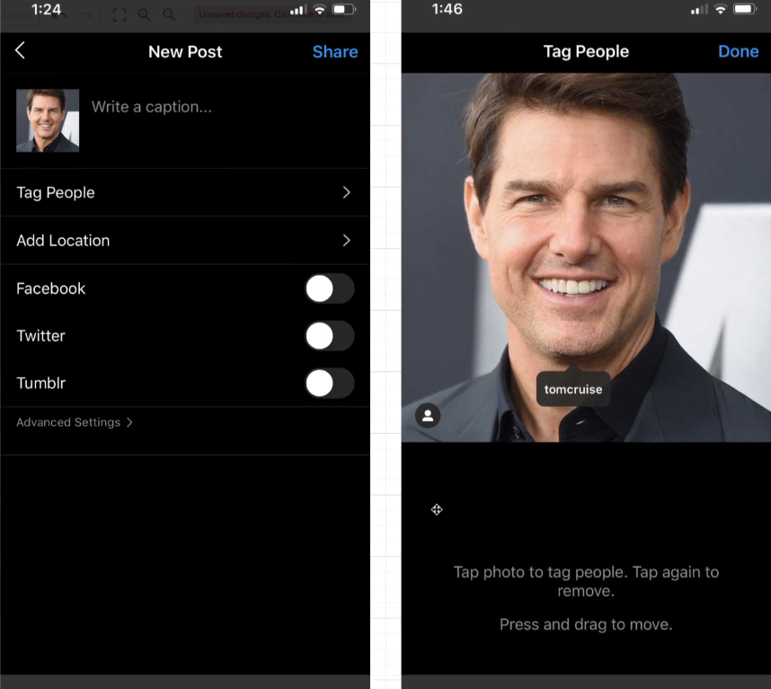

# How to Build a 'Mention' System

<p align="center">
  
</p>

## Additional Features Around Posts

In this section, we will add a few more features around posts to make our application more interactive and engaging. We will implement the following features:

1. **Mentions**: Users can mention other users in their posts by typing `@` followed by the username. When a user is mentioned, they will receive a notification about it.
2. **Tag People**: Users can tag other users in their posts either by typing `@` followed by the username or by selecting the user from a list of suggestions.

- Users can also add a tag to the photo precisely by clicking on the photo and selecting the area to tag.

3. **Location Tagging**: Users can tag a location in their posts. This will allow users to see posts from a specific location and explore new places.

- Posts must have a `longitude` and `latitude` field to store the location information.

4. **Captions**: Users can add captions to their posts to provide more context or information about the post.

- Captions can be up to `n` characters long.

## Adding Captions and Location Tagging

Let's start by adding the `caption` and location tagging features to our posts. We will modify the `posts` table to include these fields:

- `caption`: A VARCHAR(240) field to store the caption for the post.
- `lat`: A real field to store the latitude of the location.
- `lng`: A real field to store the longitude of the location.

```sql
ALTER TABLE posts
ADD COLUMN caption VARCHAR(240),
ADD COLUMN lat REAL,
ADD COLUMN lng REAL;
```

## Photo Mentions vs. Caption Mentions

When a user mentions another user in a post, they can either mention them in the photo itself (by tagging them in the photo) or in the caption of the post. We need to handle these two types of mentions differently:

1. **Photo Mentions**: When a user tags another user in the photo, we need to store the tagged user's ID along with the coordinates of the tag in the photo. This will allow us to display the tagged users when the photo is viewed.

2. **Caption Mentions**: When a user mentions another user in the caption, we need to store the mentioned user's ID in the post. This will allow us to notify the mentioned user about the mention.

- In the case of caption mentions, the mentioned user text doesn't necessarily mean that we need to store something in the database.
- The mobile app could (and probably) should handle highlighting the mentioned user in the caption text.

We would need to store the mentioned user if we want to notify them about the mention, need to show the mention in the user's profile, need to show a list of posts where the user was mentioned, etc.
