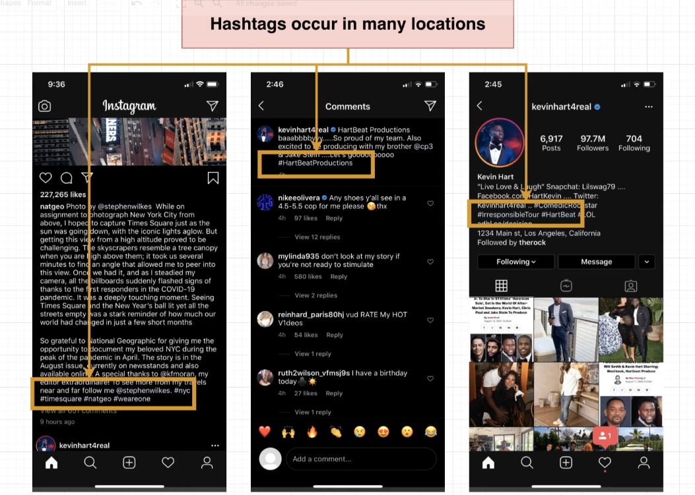

# How to Build a 'Hashtag' System

In this section, we will implement a hashtag system for our social media application. Hashtags are a popular way to categorize and discover content on social media platforms. Users can add hashtags to their posts to make them more discoverable and to join conversations around specific topics.

## What is a Hashtag?

A hashtag is a word or phrase preceded by the `#` symbol, used to categorize content on social media platforms. Hashtags are clickable and searchable, allowing users to explore posts related to a specific topic or keyword.

- Hashtags are commonly used on platforms like Twitter, Instagram, and Facebook to organize content and facilitate discussions.
- Users can click on a hashtag to view all posts that include that hashtag.
- Hashtags can be used to join trending topics, participate in challenges, or promote events.
